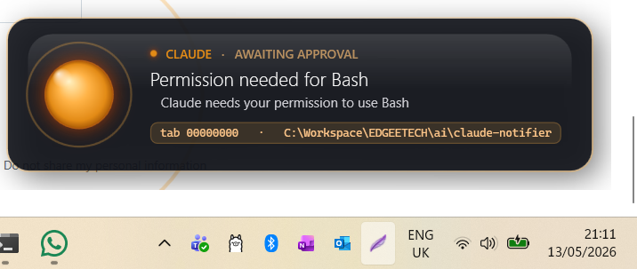
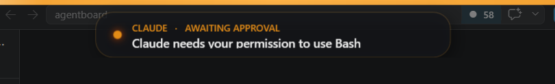

<div align="center">

# Claude Notifier

### Animated Windows notifications for [Claude Code](https://claude.com/claude-code) approval prompts

[](https://www.microsoft.com/windows)
[](https://dotnet.microsoft.com/)
[](LICENSE)
[](https://learn.microsoft.com/dotnet/desktop/wpf/)
[](https://github.com/edgeetech)

</div>

---

## Why

Claude Code runs in a terminal. When it asks for permission to use a tool, you might be in another window — another tab, another monitor, another desktop. **You miss the prompt and Claude sits idle.**

This tray app listens for Claude's permission events and surfaces them with sound, animated overlays, and a click-to-focus that jumps you directly to the waiting tab.

> Tested on Windows 11 with Windows Terminal hosting PowerShell 7.
> Multi-session aware — works with many Claude sessions across many tabs.

---

## Features

- **Three overlay styles** — pick what fits your taste:
  - **Bubble** &nbsp;`compact glass card, bottom-right`
  - **Particles** &nbsp;`large glass panel, glowing orb, expanding ripple rings`
  - **Led Bar** &nbsp;`full-width pulsing bar across the top of the screen + glass card`
- **Click to focus the originating Windows Terminal tab** — uses UIA, never spawns a new shell
- **Sound** that plays even under Focus Assist
- **Native Win11 toast** (optional, persists in Action Center)
- **Tray icon menu** — enable/disable, snooze 5m–4h, switch style, run a test notification, open log
- **Permission-only filtering** — never fires on idle pings
- **Dedupe window** — same session + tool won't double-fire
- **Kill switch** — `setx CLAUDE_TOAST_DISABLE 1` to silence instantly

---

## Screenshots

### Particles
Glassmorphic card, glowing orb, expanding ripple rings, animated entrance from the right.



### Led Bar
Full-width pulsing amber bar at the top of the screen with a glass card sliding down underneath.



---

## How it works

```
┌───────────────────┐    Notification hook    ┌──────────────────────────────────┐
│  Claude Code      │  ──────────────────►   │  ~/.claude/notify/events-*.jsonl │
│  session in WT    │  (5-line PowerShell)   │  (append-only event log)         │
└───────────────────┘                         └──────────────────────────────────┘
                                                          │
                                              FileSystemWatcher
                                                          ▼
                                              ┌──────────────────────┐
                                              │  ClaudeNotifier.exe  │   ◄── tray icon
                                              │  WPF tray app        │
                                              └──────────────────────┘
                                                  │   │   │
                                              sound │   │ animated overlay
                                                    │   │ (Bubble | Particles | Led Bar)
                                                    │   ▼
                                                    ▼   click → UIA tab focus
                                                  Win11 toast (optional)
```

**The hook is intentionally tiny.** It writes one JSON line and exits. All UI is in a separate process so the hook can never block, hang, steal focus, or kill terminal tabs.

---

## Install

### Prerequisites

- Windows 10 or 11
- [.NET 8 SDK](https://dotnet.microsoft.com/download/dotnet/8.0) (build-from-source) **or** .NET 8 Desktop Runtime (if installing pre-built binaries from a release)
- [Claude Code](https://claude.com/claude-code) installed

### One-liner install

Open PowerShell and run:

```powershell
iwr -useb https://raw.githubusercontent.com/edgeetech/claude-notifier/main/install.ps1 | iex
```

The installer will:

1. Clone the repo to `%LOCALAPPDATA%\ClaudeNotifier`
2. Build the WPF app in Release mode
3. Copy the hook script next to your Claude config
4. Patch your `settings.json` to register the `Notification` hook
5. Register a `HKCU\...\Run` autostart entry
6. Launch the app — look for the spark icon in the system tray

If you keep your Claude config in a non-default location, set `CLAUDE_CONFIG_DIR` first, then run the installer. The installer respects that variable.

### Manual install

```powershell
git clone https://github.com/edgeetech/claude-notifier.git "$env:LOCALAPPDATA\ClaudeNotifier"
cd "$env:LOCALAPPDATA\ClaudeNotifier"
dotnet build -c Release
./install-local.ps1
```

### Verify

Right-click the tray icon → **Test notification**. You should see the overlay slide in, hear a sound, and the tray entries should reflect the current config.

---

## Usage

Once installed there's nothing to do. The app runs silently and only surfaces when Claude needs your approval.

**Tray menu** (right-click the spark icon):

| Item | What it does |
|------|--------------|
| Enabled | Master switch |
| Snooze ► | Mute notifications for 5m / 15m / 1h / 4h |
| Dismiss all open overlays | Closes any visible overlay immediately |
| Play sound | Toggle audio |
| Show overlay | Toggle custom animated overlay |
| Overlay style ► | Pick `bubble` / `ledbar` / `particles` |
| Show Windows toast | Toggle native Win11 toast (off by default — avoids duplicate) |
| Click focuses tab | Toggle UIA-based tab focus on click |
| Test notification | Fires a fake event for tuning |
| Open log | Tail the notifier log |
| Open events folder | Open `~/.claude/notify/` in Explorer |
| Quit | Exit the app |

Settings are persisted at `~/.claude/notify/config.json`.

---

## Uninstall

```powershell
iwr -useb https://raw.githubusercontent.com/edgeetech/claude-notifier/main/uninstall.ps1 | iex
```

Or manually:

```powershell
Get-Process ClaudeNotifier -EA SilentlyContinue | Stop-Process -Force
Remove-ItemProperty -Path HKCU:\Software\Microsoft\Windows\CurrentVersion\Run -Name ClaudeNotifier -EA SilentlyContinue
Remove-Item -Recurse -Force "$env:LOCALAPPDATA\ClaudeNotifier"
# Then remove the Notification hook block from your Claude settings.json
```

---

## Troubleshooting

| Symptom | Fix |
|---------|-----|
| Tray icon missing after reboot | `setx CLAUDE_TOAST_DISABLE ""` then re-run installer |
| Click doesn't focus the right tab | Make sure the tab is in a Windows Terminal window (UIA can only target WT) |
| No sound when idle | The default sound file is `%WINDIR%\Media\Windows Notify.wav`; edit `config.json` to point elsewhere |
| Toast fires twice | Tray menu → uncheck **Show Windows toast** (off by default in recent builds) |
| Need to silence everything now | `setx CLAUDE_TOAST_DISABLE 1` — picks up on the next event |

Logs live at `%USERPROFILE%\.claude\notify\notifier.log`.

---

## Architecture

A short design write-up lives in [docs/DESIGN.md](docs/DESIGN.md). Highlights:

- Hook is a **5-line PowerShell** event emitter. It never owns UI.
- All UI is hosted by a **single tray app**; the hook never spawns a process tree.
- Tab focus uses **UIA `SelectionItemPattern.Select`** with three fallback strategies (exact title match, short-GUID substring, cwd basename) — and never calls `wt.exe focus-tab`.
- Window focus uses verified `WindowsTerminal.exe` PIDs only — refuses to touch any other hwnd.

---

## Contributing

PRs welcome. Keep the hook tiny — anything that needs more than 50 ms of work belongs in the app, not the hook.

Open an issue with:
- Windows version
- Windows Terminal version
- Claude Code version
- Excerpt from `notifier.log` showing the misbehavior

---

<div align="center">

Made with ☕ and a dim attention span by **[EdgeeTech](https://github.com/edgeetech)**.

</div>
